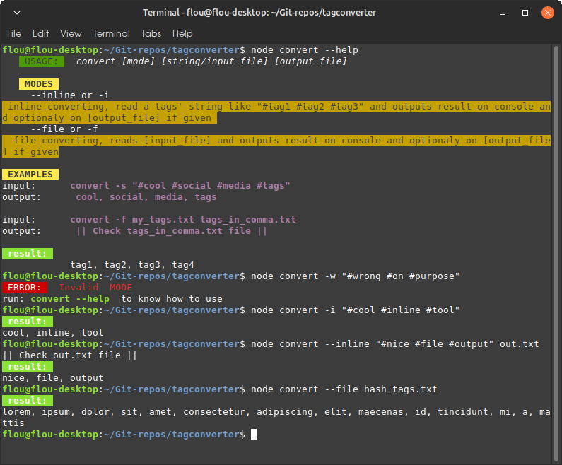

# A NODE.js CLI HASH TAGS LIST TO COMMA LIST CONVERTER
Its a project made for studying purpose, my goal here was to undertand better how node handle files and command line arguments

Everything was made with builtin modules to avoid using NPM and keep it simple, so the colored console.logs() part of the code are very ugly for an example.



# HOW TO USE
1) You have to have node.js installed on your machine
2) Open a terminal on the project folder
3) Type in node convert -h to read its builting usage explanation

# TEST IT WITH PROVIDED FILE
There is a tags.txt file filled with some "lorem Ipsum" hash tags.

You can use convert.js to read this file and output on given file

**Here is how**:
```bash
node convert --file hash_tags.txt comma_tags.txt
```
The result should apear on console and also in the `comma_tags.txt` recently added to the project folder.
